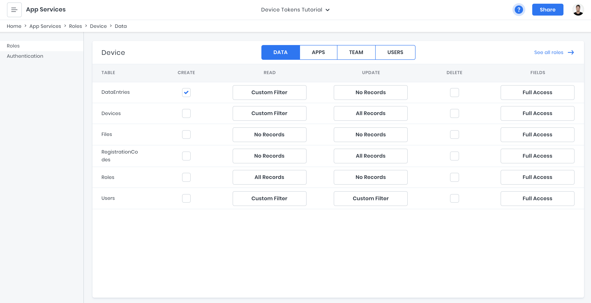

# Securely Authorizing Devices using API Tokens

When we think of authorization in app development, it's usually from the perspective of a user that has specific roles and permissions. For example, a fitness app that tracks a user's workouts might allow an _Athlete_ (user role) to create journal entries, as well only read their own journal entries from the API. Most applications that are user-centric and data-driven end up thinking through and defining these types of scenarios; _who_ can do _what_?

That said, not all applications are centered around an individually logged-in user. It's not uncommon that authorization for a given application needs to be handled within the context of a device. Think of Internet of Things (IoT) devices, VR headsets, registration kiosks, and others where the device itself - or installed application - is the authenticated entity.

Sometimes, this type of authorization is used purely for secure machine-to-machine applications, such as factory monitoring devices where sensors send equipment data to a central monitoring system. Other times, a single device is authorized so that multiple-users can access it at a given time, like an event registration kiosk. Regardless of the specific use case, what's required is a reliable system for authenticating devices, generating API tokens, assigning those tokens the necessary authorizations, and returning a credential back to the device.

## Tutorial

In this tutorial we're going to develop a strategy for registering devices. This system could work for a number of different use-cases, so feel encouraged to reach out and ask questions if you need help tailoring it more specifically to your own application.

**Technologies:**

1. 8base Workspace - Backend-as-a-Service with GraphQL API
2. Node.js - JavaScript runtime environment that executes JavaScript code outside a web browser

## Step 1 - Setting up the "Device"

We're going to write several simple scripts that we can execute manually from the command line. One will allow us to register the device and receive a token, others will make authenticated requests for sending data to and reading data from the API. In this scenario, think of the _Device_ as being your computer.

Clone this project so that you can look through each script as we reference what's happening.

```sh
# Clone the repo
git clone https://github.com/8base/managing-devices-using-api-tokens.git eighbase-device-tokens-tutorial
# Move into the directory
cd eighbase-device-tokens-tutorial
```

To get a general understanding of what we're dealing with, below is the _device_ repos structure. Each function in the `device/src/functions` directory can be run using the command `npm run exec [FUNCTION_NAME] [ARG]`. Meanwhile, `device/src/utils/api.js` is our API module for executing GraphQL requests and `device/src/storage/index.js` simply writes JSON data to a local file.

```sh
device/
  ├── package-lock.json
  ├── package.json
  └── src
      ├── functions
      │    ├── readActivity.js
      │    ├── registerDevice.js
      │    └── sendActivity.js
      ├── index.js
      ├── storage
      │    ├── data.json
      │    └── index.js
      └── utils
          └── api.js
```

The three functions are very straight forward. The `registerDevice.js` script is the one we'll use to send a registration code and receive back an API Token, while `readActivity.js` runs a query and `sendActivity.js` runs a mutation. Using these, we'll be able to test our device is working.

If you take a moment to look through these files, you'll find that they all have a pretty similar structure. Each one defines a GraphQL call, runs it, and then handles the response or error. If you would like more context, all code files have inline comments.

There is only one spot in the code that you'll need to update a value. On line 12 of `device/src/utils/api.js`, update the `<EIGHTBASE_WORKSPACE_API_ENDPOINT>` placeholder with your workspaces endpoint.

## Step 2 - Setting up the Backend

There are a few very useful features here that we can leverage from 8base. They are API Tokens, Roles & Permissions, and Serverless Functions. If you want to spend some time learning how to build data-models, [this video](https://www.youtube.com/watch?v=JIEG3oL-iHs) and [this documentation](https://docs.8base.com/docs/8base-console/platform-tools/data-builder) is a great place to start. For this tutorial however, we can import the required schema to our workspace using the 8base CLI.

If you haven't already, go ahead and install the 8base CLI tool. We'll use it to import our schema file, as well as deploy a Serverless Function to your 8base workspace that will handle the registration of a device.

```sh
# Install the 8base CLI
npm install --global 8base-cli
# Move into the server directory
cd ../server
# Authenticate the 8base CLI
8base login
# Configure the project to your workspace (Select your workspace)
8base configure
# Import the schema to your workspace
8base import -f schema.json
```

Once the import is finished, go to [the 8base workspace console](https://app.8base.com). In the _Data Builder_, you should see 3 tables that have been created. Below is a list of them with their given relationships.

1. **RegistrationCodes** - Codes that a device will use to register.

- _has_one_ Device

2. **Devices** - The record created for a single registered device.

- _has_one_ RegistrationCode
- _has_many_ DataEntries

3. **DataEntries** - A record we'll use to save device data to and read it back.

- _has_one_ Device


## Step 2.1 - Defining Roles and Permission

The next step we're going to need to take is defining the _Role_ a device will have and it's associated permissions.

Navigate to [_App Services > Roles_](https://app.8base.com/app-services/roles) and click the "+" button to add a role. Name it "Device" and optionally throw in a description if you feel like it. Once created, click on the role to enter into the permissions view.

Roles and permissions are extremely specific to any given project/implementation. That said, for this one there are a few permissions that our device will require in order to successfully run its scripts. To start though, make sure all permissions are turned off.

In order to make sure any registered device only has access to the records relevant to itself, we're going to use custom filters that use the API Token that authorizes a request to scope the records.

**DataEntries**

- _Create_ (CHECKED)
- _Read_ (Custom Filter) `{ "device": { "apiToken": { "token": { "equals": "__requestingApiToken" } } } }`

**Devices**

- _Read_ (Custom Filter) `{ "apiToken": { "token": { "equals": "__requestingApiToken" } } }`
- _Update_ (Custom Filter) `{ "apiToken": { "token": { "equals": "__requestingApiToken" } } }`

When an authenticated API request comes in, 8base will swap out the `__requestingApiToken` variable with the API Token. This allows you to use the API Token as a dynamic variable within a permission's custom filter to scope data based on a given role.



## 2.2 Deploying our Serverless Function

While 8base provides a fully managed application backend, we're able to extend the API and deploy/execute server-side logic using Serverless Functions. In this case, we're going to be adding a function called `registerDevice` that will handle the validation, creation, assignment, and issuance of API Tokens and registration codes.

Go back to the `server` directory of the project you cloned. Below is the code with inline comments found at `server/src/resolvers/registerDevice/*`. Let's look through the comments before deploying it to the workspace.

**schema.graphql**

```graphql
# Returns device ID and apiToken
type RegisterDeviceResult {
  id: String!
  apiToken: String!
}

# Mutation accepts registration code as argument
extend type Mutation {
  registerDevice(code: String!): RegisterDeviceResult
}
```

**handler.js**

```js
import gql from "graphql-tag";
/**
 * To invoke this function locally, run:
 *  8base invoke-local registerDevice -m request
 */

/* Disable permissions when making server-side API calls */
const NoCheck = {
  checkPermissions: false,
};

/**
 * Query for the registration code.
 */
const REGISTRATION_CODE_QUERY = gql`
  query($code: String!) {
    registrationCode(code: $code) {
      id
      code
      device {
        id
      }
    }
  }
`;

/**
 * Create the API Token Mutation. When creating the api token
 * we also go ahead and connect our Device role to it.
 */
const CREATE_API_TOKEN_MUTATION = gql`
  mutation($name: String!) {
    apiTokenCreate(
      data: { name: $name, roles: { connect: { name: "Device" } } }
    ) {
      id
      token
    }
  }
`;

/**
 * Create the device Device and connect it with the
 * token and registration code.
 */
const CREATE_DEVICE_MUTATION = gql`
  mutation($tokenId: ID!, $codeId: ID!, $name: String!) {
    deviceCreate(
      data: {
        name: $name
        apiToken: { connect: { id: $tokenId } }
        registrationCode: { connect: { id: $codeId } }
      }
    ) {
      id
      createdAt
    }
  }
`;

export default async (event, ctx) => {
  /* Get registration code from mutation args */
  const { code } = event.data;

  /* Query the code to see if it actually exists */
  const { registrationCode } = await ctx.api.gqlRequest(
    REGISTRATION_CODE_QUERY,
    { code },
    NoCheck
  );

  /* Variable */
  let tokenId = "";
  let apiToken = "";

  /* If no code is found, return not found error */
  if (!registrationCode) {
    return {
      data: {
        apiToken,
      },
      errors: [
        {
          message: "The submitted registration code was not found.",
          code: "code_not_found",
        },
      ],
    };
    /* If code is already assigned to device, return code assigned error */
  } else if (registrationCode.device) {
    return {
      data: {
        apiToken,
      },
      errors: [
        {
          message: "The submitted registration code was already used.",
          code: "code_assigned",
        },
      ],
    };
    /* If the code is valid, create a new API Token */
  } else {
    ({
      apiTokenCreate: { id: tokenId, token: apiToken },
    } = await ctx.api.gqlRequest(
      CREATE_API_TOKEN_MUTATION,
      {
        name: `DEVICE_${code}_TOKEN`,
      },
      NoCheck
    ));
  }
  /**
   * Create a new device and connect it to
   * the API Token and Registration code.
   */
  const {
    deviceCreate: { createdAt, id },
  } = await ctx.api.gqlRequest(
    CREATE_DEVICE_MUTATION,
    {
      codeId: registrationCode.id,
      name: `DEVICE_${code}`,
      tokenId,
    },
    NoCheck
  );
  /* eslint-disable-next-line no-console */
  console.log(`Token added to device with ID ${id} at ${createdAt}`);
  /**
   * Return device id and apiToken in response
   */
  return {
    data: {
      id,
      apiToken,
    },
    errors: [],
  };
};
```

Having familiarized ourselves with the resolver function, lets deploy it. Go ahead and run `8base deploy` from within the `server` directory. Once deployed, you'll need to update one last thing in roles and permissions.

Essentially, the _Guest_ role defines what resources and permissions an unathenticated request has access to. Since a device will need to register before having received an API Token, we need to make sure there is public access to our `registerDevice` operation.

In [_App Services > Roles_](https://app.8base.com/app-services/roles) click on the _Guest_ role and go to the _Apps_ tab. After deploying the function, "Register Device" should appear under the _Api_ section. Make sure that it is enabled!


## Testing the Device

Let's go ahead and try out our Device! Go back into the `devices` directory using the command line and install all required dependencies.

```sh
# Change into devices directory
cd ../devices
# Install dependencies
npm install
```

First off, let's make sure that our API rejects requests that are not authenticated.

```sh
npm run exec readActivity

=> [
  {
    message: "You don't have permission to perform this operation",
    locations: [ [Object] ],
    path: [ 'dataEntriesList' ],
    code: 'NotAuthorizedError',
    details: {
      permissions: "You don't have permission to perform this operation"
    }
  }
]
```

Next, let's register our device. In your 8base workspace, go ahead and add a new _registrationCode_ with the code set to `1234567890`.


Once added, go back to the terminal and run the following command.

```sh
npm run exec registerDevice 1234567890

=> Adding to storage:  {
  id: 'ckd8ykgbu002n08mo4ea59wby',
  apiToken: '415029c8-ecac-44bd-bfa4-97fc18388afa'
}
Device registered
```

Awesome! The device is registered. If you want to see what's changed on the server-side, hop back into the 8base console's _Data Viewer_ and you'll see all the relationships and device records have been created. Also, an API Token will have been generated that can be found in [_Settings > API Tokens_](https://app.8base.com/settings/api-tokens).

Now let's add some activity.

```sh
npm run exec sendActivity 100

=> Entry 100 saved to device ckd8ykgbu002n08mo4ea59wby
```

And finally, read the activity.

```sh
npm run exec readActivity

=> [
  {
    createdAt: '2020-07-30T15:35:47.565Z',
    value: 100,
    __typename: 'DataEntry'
  }
]
```

Everything seems to be working!

## Wrap up

In this tutorial, we implemented a strategy for authenticating connected devices using API Tokens, a GraphQL API, Roles and Permissions, and Serverless Functions. There are many enhancements and improvements that could be made to it, like expiration dates on registration codes. That said, this general structure provides a great starting point from which you can move forward.

If you have any questions, please feel free to reach out. All the code used in this project is available on GitHub in the [tutorial's repo](https://github.com/8base/managing-devices-using-api-tokens).
